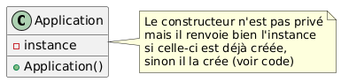

# Projet-POO-Sherbrooke - Lilian Bouchard

### DP Singleton

Le DP singleton est utilisé avec la classe ``Application``. Il permet qu'une seule instance de cette classe ne soit créée et aussi que l'on puisse s'y référer sans passer l'instance en paramètre des fonctions. Cette instance est appelée avec ``instance = Application()``.

    

