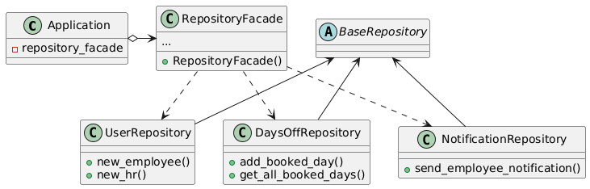
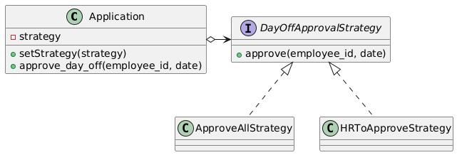
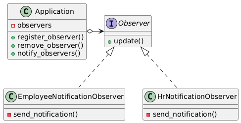

# Projet-POO-Sherbrooke - Lilian Bouchard

### DP Singleton

Le DP singleton est utilisé avec la classe ``Application``. Il permet qu'une seule instance de cette classe ne soit créée et aussi que l'on puisse s'y référer sans passer l'instance en paramètre des fonctions. Cette instance est appelée avec ``instance = Application()``.

    

### DP Repository

Un DP repository est utilisé pour chaque table dans la base de données. Ils servent à faire le lien entre l'application python et les requêtes SQL. Dans l'application, on utilise un DP facade pour simplifier les accès à la base de données.

### DP Facade

Le DP facade est utilisé pour simplifier les interactions avec la base de données. On y accède depuis l'instance de la classe ``Application`` car une instance de la facade y est conservée.

    

### DP Strategy

Le DP Strategy est utilisé pour approuver ou refuser automatiquement les jours de congé des employés. Le système peut aussi laisser la main aux RH. La stratégie est déterminée à l'exécution et ce sont les RH qui décident de la stratégie à adopter. Une instance de la stratégie est conservée dans ``Application``.

    

### DP Observer

Le DP observer est utilisé par dessus le système de notification dans l'application. Les observateurs observent l'instance de la classe ``Application`` et envoient des notifications en fonction.

    

